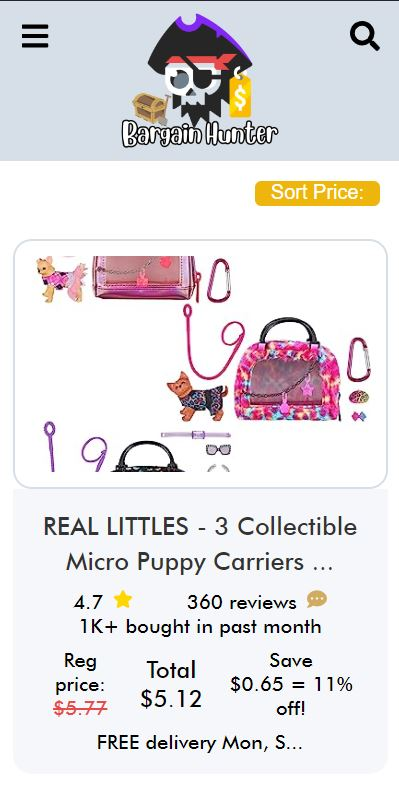
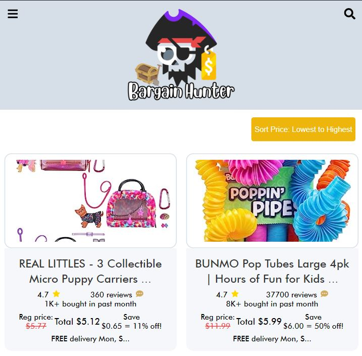
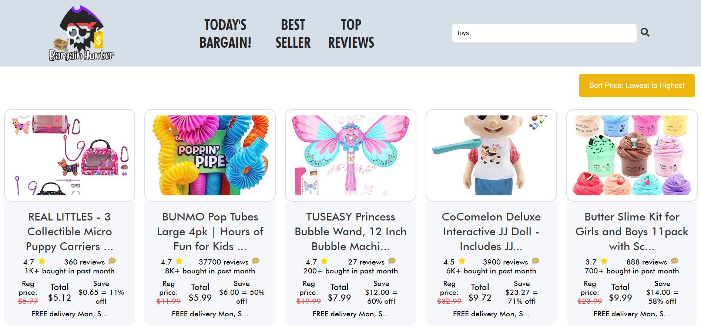

# Bargain Hunter Web Application
Bargain Hunter is a responsive web application designed to help users discover real time prices of products in amazon to get the best deals, view top rated items and reviews online. With its intuitive user interface, users can navigate through top deals, best sellers, and view the reviews on sorting prices from lowest to highest.

## 📸 Screenshots

## 📝 Features and/or Usage Instructions
- **Responsive Navigation**: Mobile-optimized navigation that adjusts to the user's device.
- **Dynamic Search**: A search bar with auto-suggest capabilities, enhancing user experience.
- **Personalized Routes**: Easily navigate through deals, top reviews, and best-selling products based on the search query paramater.
- **Sort Prices**: You can sort prices from lowest to highest to get the best deals
- **Search Bar**: Simply type in your desired product or category and get results.
- **Profile**: Access real time prices of products in amazon to get the best deals.

## 🚀 Installation
1. Clone the repo: git clone https://github.com/ralphdaryn/bargain-hunter.git
2. cd bargain-hunter
3. npm install
4. run nodemon server.js
5. npm start

## 🛠️ Tech Stack
- **React**: For dynamic user interface components.
- **SCSS**: Syntactically Awesome Style Sheets, a CSS preprocessor.
- **Node Express**: Back-end framework for Node.js.
- **React Router**: Declarative routing for React apps.
- **Axios**: HTTP client used for API calls to browser & Node.js.
- **Nodemon**: Monitors changes and automatically restarts the server.
- **React Icons**: Integrate popular icons into React projects.
- **Postman**: Provides a user-friendly interface to send requests to web services and view their responses in return.

## 🌐 API Reference
- **Oxylabs**: E-Commerce Scraper API: https://oxylabs.io/

## 🧠 Lessons Learned & Next Steps:
Lessons Learned:
Responsive Design: Designing from mobiles to desktops, is crucial for a universal user experience. The project reinforced the significance of mobile-first design principles.

API Integration: Integrating Oxylabs API helped me understand the third-party data integration and handling real-time data efficiently using their documentation online.

State Management: With React, managing state and ensuring the data flows correctly across components was both a challenge and a learning curve.

Optimization: Learning to optimize API calls and ensuring the application runs smoothly was vital, especially when dealing with limited data.

Next Steps:
User Accounts: Implement user authentication to allow users to save favorite products and set price alerts.

Machine Learning: Incorporate a recommendation system that suggests products based on user's browsing history and preferences.

Localization: Expand the application's reach by supporting multiple languages and regions.

Feedback System: Implement a system where users can give feedback on the deals, helping to improve the accuracy and relevancy of the bargains presented